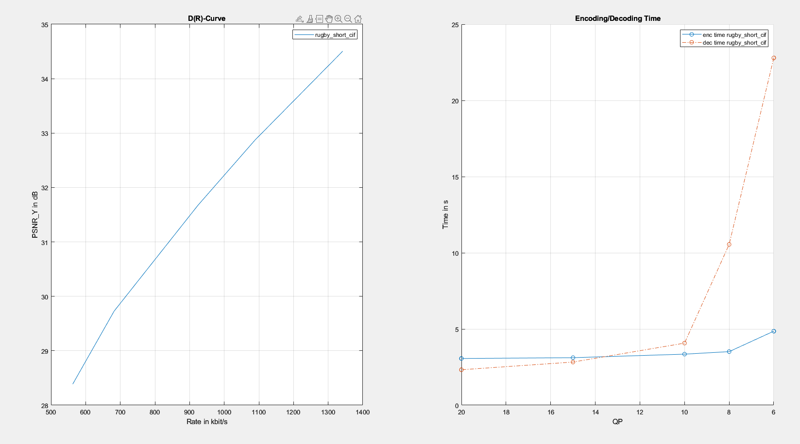

# <Project Title> From-Scratch Video Codec (MATLAB)

A from-scratch video codec in MATLAB that compresses raw video, reconstructs it, and
builds rate–distortion (DR) curves. It is based on the H.264/AVC standard, and was part of my internship at
FAU Erlangen-Nürnberg in the domain Image and Video Compression. 

## Highlights
- Block-based video codec implemented in MATLAB: DCT/IDCT for transform coding, quantization, Huffman entropy coding,
  motion estimation/compensation, and Rate–Distortion (DR) curve evaluation.
- Outputs: compressed bitstream + decompressed video.
- Evaluation: DR curves (PSNR vs bitrate).

## Quick Start
```matlab
% Encode, Decode and plot DR-Curve
Use src/run.m: You can choose one of the .yuv video files present or make your own. Running this function will
plot the DR-Curve according to different QP (Quantization Parameter) values, and also save the compressed bitstream, 
and reconstructed video in .yuv format.

% .yuv viewer
You can use src/play_yuv_clip.m to view the selected clip.
```

## Results

### Rate–Distortion Curve


### Decoded Preview — Original vs Decoded


**Stats for the previewed clip**

- Resolution / FPS / Frames: **352×288 (CIF)**, **30 fps**, **100 frames (0–99)**
- Average PSNR (Y): **33.959 dB**
- Compressed size used for stats: **108 KB** (110,592 bytes)
- Evaluated clip duration: **≈3.33 s**
- Bitrate: **≈265.4 kbps**
- Bits per pixel (bpp): **0.0873**
- Compression ratio: **137.50×**  
  *(15.2064 MB raw → 0.108 MB compressed over the evaluated segment)*

## Requirements
MATLAB R2022b

  
